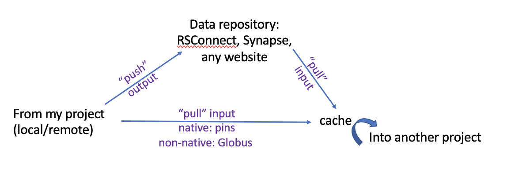

**Goals:**

* Keep shared data (including processed data and results) in a stable shared location
* Link to data instead of copying/moving data
* Incorporate data linking in your script  
* Treat processed data and results as "raw" data objects for sharing purposes
* Describe data: origin, what's been done with it, what the columns/rows mean, etc.
* keep data files together with their metadata and any processing scripts when applicable, either physically or with a reliable link between them.

A good way to interact with data objects is in a manner similar to working with git for developing code: "pushing" and "pulling" data objects to and from remote repositories from within your working directory, scripting everything, instead of copying data manually into the project folder. This not only makes work easier, but also helps maintain data provenance and promotes transparency and reproducibility. Github repositories, however, are (currently) limited in size and are therefore not optimal for sharing large data objects and research projects. Instead we can use services such as Synapse and RStudio Connect and tools such as [Globus CLI](https://docs.globus.org) and the R [`pins` package](http://pins.rstudio.com). In addition to providing a way to incorporate data transfer in the script, these tools also manage the caching and check for updates beforing re-downloading data. The caching ensures that we still have the latest version available in our system in the case that the original becomes unavailable for whatever reason.     

Sharing data between "native" projects on the same file system can be done using the R package `pins` (see below). Sharing data among file systems (e.g., between tier1, tier2, and local) can be done either directly with Globus or via servers such as Synapse and RStudio Connect. Interacting with servers such as Synapse and RStudio Connect can be done using either their own clients (see below) or with `pins`.  




To read more about data provenance and management:  
https://old.dataone.org/sites/all/documents/DataONE_BP_Primer_020212.pdf  
https://www.w3.org/2005/Incubator/prov/wiki/What_Is_Provenance  
https://docs.synapse.org/articles/provenance.html  

An example for a resource sharing plan to include in NIH grants:   https://github.com/lab-carpentry/blueprint-resourcesharing/blob/master/examples/NIH-example.md  

## From Scientific Services
Because this data transfer is meant to be a one-time thing - data is permanently moved from GT to its (presumably) final resting place in our lab storage - there is no need to include it in any script. Therefore, this can be done using the [Globus web interface](https://docs.globus.org/how-to/get-started/) if that is more convenient.  

* Keep data files together with all the metadata that come with them.  
* Keep data in a shared designated location, not in your home directory and not under your name.  
For example: `/projects/hepatocytes/data/RRBS/`  
and not `/projects/hepatocytes/USERNAME/data/RRBS`  
nor `/projects/hepatocytes/data/USERNAME/RRBS`    
* Set permissions to be accessible to everyone in the Carter-Lab group: `chmod -R 775`  
* Don't change file names or content. Leave the raw data raw.  

## From Synapse
https://docs.synapse.org/articles/  
Often the best way to work with data that live on Synapse is to download/upload them directly from Synapse using its [R](https://r-docs.synapse.org/articles/synapser.html), [pyhton](https://python-docs.synapse.org/build/html/index.html), or [CLI](https://python-docs.synapse.org/build/html/CommandLineClient.html) clients.  
See [here](https://docs.synapse.org/articles/provenance.html) for how provenance works on Synapse.  

For example, using the R package `synapser`:  
The function `synGet()` downloads the data into a cache folder in your home directory (`~/.synapseCache`) in whichever file system you're on. Every time you run the code, it checks your cached copy against the original on Synapse and re-downloads it only if there has been changes since the last download. The cache location is specified in `~/.synapseConfig`.  
For example, if I need to use mayo metadata (syn11384571) in my analysis:

```r
### input code
library(tidyverse)

synLogin() # include this in every chunk that connects to Synapse

mayo <- synapser::synGet("syn11384571")$path %>%  # downloading the file from synapse to the cache
  read_csv() %>%                                  # loading it from the cache into the workspace
  select(WGS_Participant_ID, ApoE, Diagnosis) %>% # modifying for this analysis: selecting variables
  mutate(cohort="mayo")                           # modifying for this analysis: adding cohort
```
See [here](https://r-docs.synapse.org/articles/manageSynapseCredentials.html) on how to specify your login credentials in `.synapseConfig`.  
This works the same way from your local machine or RStudio Server. The config file and cache folder will be on your RStudio Server home directory (`/unixhome`).  

Similarly, it is possible to upload (push/publish) your results back to synapse, and specify its relations to other synapse entities, using the `synStore()` function. This allows other users to interact with your results with synGet() as described above. With this function you can also upload the script that was used for generating those results and specify their relations as their provenance.  

This code takes the output file `ADvariants_anno.txt`, turns it into a file object that synapse understands, including the folder in which it should be stored ('parent'), and stores it along with its provenance. The function `Activity()` generates a provenance object that specifies in this case the script that was used to generate it (also stored on synapse as 'syn23595214').

```r
file <- File("output/ADvariants_anno.txt",
             contentType = "text/plain",
             description = "LOAD variant list",
             parent = "syn23569714")
provenance <- Activity(executed = "syn23595214")
file <- synStore(file, activity=provenance)
```
See [here](https://www.synapse.org/#!Synapse:syn7419026/wiki/606653) for an example of how to share an analysis script and results and describe them using the Synapse provenance tool. The .Rmd file in this example includes input and output chunks that demonstrate the use of `synapser` to download and upload data directly from and to Synapse.

The package [knit2synapse](https://github.com/Sage-Bionetworks/knit2synapse) allows you to knit Rmarkdown files directly to synapse as a wiki page.    

Since we usually work with secured and/or very heavy data from Synapse, we have synapse cache folder inside the sdata folder on both tier1 and tier2 to ensure that the data remain in a secured location when downloaded. Using this cache folder instead of the one on your home directory will also spare you the need to download your own copy, saving you space.  
To do that, open the `.synapseConfig` file in your home directory and edit the caching part to look like this for tier2 data:
```
###########################
# Caching                 #
###########################

## your downloaded files are cached to avoid repeat downloads of the same file. change 'location' to use a different folder on your computer as the cache location
[cache]
location = /tier2/carter-lab/sdata/AMPAD/.synapseCache
```
The location on tier1 is `/sdata/carter-lab/carter/AMPAD/.synapseCache`
  
It is also possible to provide a different path to download a file from synapse, thus bypassing the cache. This is useful if we want to keep files in a more visible location than the cache. It would still check for updates before downloading and allow you to incorporate data transfer in the script. For example:

```r
file <- "NIA_JG_1898_samples_GRM_WGS_b37_JointAnalysis01_2017-12-08_19.recalibrated_variants.annotated.txt"
synid <- synFindEntityId(file, parent="syn11707420")
synpath <- synapser::synGet(synid, downloadLocation="sdata/AMPAD/synapseData/ROSMAP/WGS/")$path
# using fread() here because it's a very big file:
annot <- data.table::fread(file=synpath, sep="\t") 
```

## From RStudio Connect
[RStudio Connect](https://docs.rstudio.com/connect/user/) is useful for sharing reports, R objects, and various files between different projects from different locations. It is especially useful for projects that are being developed on RStudio Server and live on tier2. From RStudio you can easily [publish content](https://docs.rstudio.com/connect/user/publishing/) to RStudio Connect using the publish button in either the editor or the preview windows.  

Using the package [`connectapi`](https://rstudio.github.io/connectapi/) it is very similar to working with Synapse.  
Another option is to use `pins` and its built-in [RStudio Connect board](https://docs.rstudio.com/connect/user/pins/) functionality (see below).   

## Using pins
http://pins.rstudio.com/  
The R package `pins` works by pinning data objects to boards (See image below). A type of board is basically a connection to a type of location (data repository), such as RStudio Connect and Github, or another folder. Registering a board opens that connection for that session. The local board (local to whichever file system you're on) is by default the cache folder, which by default is `~/Library/Caches/pins` on a mac, and is registered automatically when loading the package. You can see it under the connections tab in RStudio.  
The function `pin()` sends ('pushes') an object from the current workspace into the specified board. If `board='local'` the object is pinned into the cache, thus made available to other projects on that file system and to future sessions. The function `pin_get()` retrieves ('pulls') the object from the board into the workspace via the cache - or from the cache if `board='local'` - while checking the original source for updates. In either cases, some basic standardized information about the object is being logged into a text file in the cache folder, creating basic documentation on what is stored there.   


There can be many connections open to one type of board in a given session, but you'd need to register them separately (per session) under different names.

### Between projects in the same file system
Often we generate results in one project that we then need to use in another "native" project that lives in the same file system. We can either publish these results to RStudio Connect (or to Synapse) and interact with them as described above, or we can pin the results to the local cache (local to the system we're working in) and pull them into the other project from there, as shown below.   
  
For example, say I generated a dataframe object with the archetype classification for ROSMAP patients as part of the ampad_archetypes project that lives on tier2. The script that created that result is in `/tier2/carter-lab/sdata/AMPAD/ampad_archetypes/analyses/rnaseq/1_fit_archetypes/1_fit_archetypes.Rmd`. At the end of that Rmarkdown file I include a chunk that pins the generated data object to a local board:

```r
# output chunk of 1_fit_archetypes.Rmd
pin(archetypes_meta, 
    name = "archetypes_meta_k3p20_AD", 
    description = "Archetype classification. Output of ampad_archetypes/analyses/rnaseq/1_fit_archetypes/1_fit_archetypes.Rmd",
    board = "local")
```
Now I can close that session, start a new one within a different project on tier2, say `ampad_ADvariants` and in its Rmarkdown file I can include a chunk that retrieves that data file from the local cache, and then modifies it.

```r
# input chunk of ampad_ADvariants_MCA.Rmd, 
archetypes <- pin_get("archetypes_meta_k3p20_AD", board="local") %>%
  select(wgs_id, Archetype) %>%
  filter(!is.na(wgs_id))
```

This works the same way from RStudio Server as from your local machine. The local board in RStudio Server is on your home dir on the RStudio Server `~/.cache/pins`. To see this information you can type `pins::board_get("local")`

If you're working with secure data, and you want to pin your results locally for later use, you'd need to pin them to the sdata folder (on tier1 or tier2) instead of the cache. For this purpose, you'd want to register a new local board that points to the pins cache on sdata (once per session). For example, you might have a code chunk like this in your Rmarkdown file:

```r
pins::board_register_local(name = "sdata", cache = "/sdata/.cache/pins")

synapser::synLogin() # include this in every chunk that connects to Synapse

mayo <- read_csv(synapser::synGet("syn11384571")$path) %>%
  select(WGS_Participant_ID, ApoE, Diagnosis) %>%
  mutate(cohort="mayo") %>%
  pins::pin(name="mayo_metadata_wgs_apoe_diagnosis", 
        description="ouput of <path/rmd_file> etc", 
        board="sdata")
```
Please see instructions above on how to configure `synGet()` to download data into the secured cache folder on tier1 and tier2 instead of your home directory.

In order to retrieve the modified file in another session:

```r
board_register_local(name = "sdata", cache = "/sdata/.cache/pins")
pin_find("mayo", board="sdata")               # see everything available in that board for mayo cohort
pin_info("mayo_metadata_wgs_apoe_diagnosis")  # retrieve info for this data frame
mayo <- pin_get("mayo_metadata_wgs_apoe_diagnosis", board="sdata")  # load from sdata chache to workspace
```

### Between different file systems
A good way to share data and results between different projects (whether on the same file system or not) is via a remote server such as RStudio Connect or Synapse. `pins` has a built-in board functionality for RStudio Connect, github, and any url, as well as other common services. It also has functions to create new types of boards, so it's probably possible to create a board for Dropbox and Synapse as well.  
See [here](http://pins.rstudio.com/articles/boards-rsconnect.html) and [here](http://pins.rstudio.com/articles/use-cases/reuse-tidy-datasets.html) for how to use pins with RStudio Connect.

Before using RStudio Connect as a board, you need to authenticate it first. If you're working with RStudio, you can register the RStudio Connect account in RStudio using Tools -> Global Options -> Publishing -> Connect, and then you simply register the board with `board_register_rsconnect(name="jax_rsconnect", server = "https://rshiny.jax.org")` (the name can be anything) and use the same chuncks of code as above but with "jax_rsconnect" as a board.  
If you want to register the board from outside RStudio, you'll need to include an API key in that command as shown [here](https://docs.rstudio.com/connect/user/pins/) 
