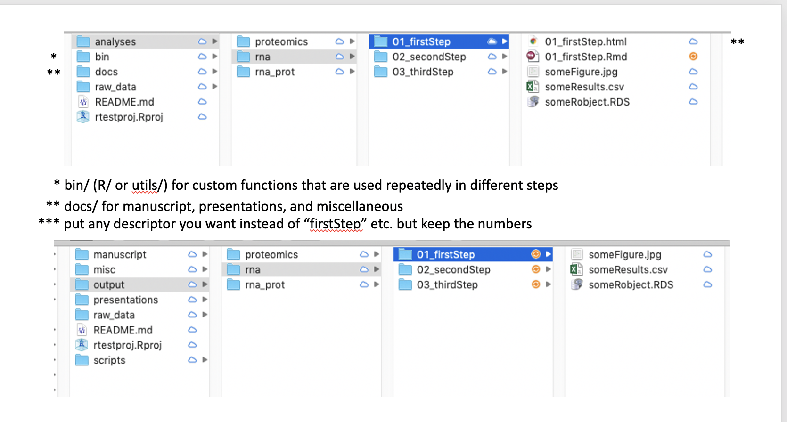

```{r setup, include=FALSE}
knitr::opts_chunk$set(echo = TRUE, eval=FALSE)
```

In 2016 a consortium of scientists and organizations published ["The FAIR Guiding Principles for scientific data management and stewardship”](https://www.nature.com/articles/sdata201618
). It has since been endorsed by [G20](https://www.dtls.nl/2016/09/13/g20-endorse-fair-principles/), [library associations](https://libereurope.eu/blog/2017/12/08/implementing-fair-data-principles-role-libraries/), and [many other](https://en.wikipedia.org/wiki/FAIR_data#Acceptance_and_implementation_of_FAIR_data_principles) [research organizations](https://www.sciencedirect.com/science/article/pii/S1359644618303039).

**Motivation:**  
From the FAIR publication:  
“Beyond proper collection, annotation, and archival, data stewardship includes the notion of ‘long-term care’ of valuable digital assets, with the goal that they should be reusable for downstream investigations, either alone, or in combination with newly generated data... The principles apply not only to ‘data’ in the conventional sense, but also to the algorithms, tools, and workflows that led to that data: all components of the research process must be available to ensure transparency, reproducibility, and reusability.”

To that end, we can think of a computational project as a data object in the broad sense  - an identifiable digital item that includes data elements such as tables of measurements along with all the relevant metadata and scripts - and apply FAIR principles to all aspects of the project, including organization, development, and publication. Project components may be of any level of complexity and appear in any form or syntax. Documentation of wet-lab components can and should be included in some form as well.  


**Goals:**

* To allow both humans and machines to make sense of the data as is
* To allow the reader/collaborator to reproduce the whole paper/analysis with a click of a button (or a few)
* To provide a record of our *in silico* experiments similar to [a wet-lab notebook](https://snco.com/standards-keeping-laboratory-notebook/?gclid=CjwKCAiAqJn9BRB0EiwAJ1SztfIEQ-WHthk7yfS2kGQ9Ednvk1cnthKj1uRTTrtgV-AC_AkUUl9flhoCyiUQAvD_BwE)

Here are some rules of thumb for how to set up and organize a FAIR-compliant project. See below for more details. See other sections for acquiring and sharing data and for publishing.

**Rules of thumb:**

* Set up your project folder as a formal R project in RStudio, or some equivalent of that  
* Use standardized naming and structure following community conventions.  
* Keep raw data separate from scripts and output (see separate section on acquiring data)
* Treat input data as read-only and output as disposable. [Script everything](https://kbroman.org/steps2rr/pages/scripts.html). 
* Include a “dumbed-down” [README file](https://data.research.cornell.edu/content/readme) as a walk-through (maybe a flow chart; maybe md file)
* Include a license file as needed; CC-0 and CC-BY are [commonly used](https://blog.datadryad.org/2017/09/11/some-dos-and-donts-for-cc0/)

* If your project involves working on several file systems, duplicate whole project folders, not bits and pieces of data/code (see image below).  
  * Consider syncing your local copy with Dropbox for extra backup and version control.
  * Keep a remote copy on tier1 if you're working on this project mainly on the cluster.  
  * Keep a remote copy on tier2 if you're working on this project mainly in Rstudio Server.  
  * Syncronize the local and remote copies using Globus, FileZila, or the like.  
  * Consider [using git](https://git-scm.com/book/en/v2) for version control and sharing of code.  


**Other good references:**  
https://datacarpentry.org/organization-genomics/  
https://datacarpentry.org/shell-genomics/06-organization/index.html  
https://kbroman.org/steps2rr/  
https://community.rstudio.com/t/best-practice-for-good-documented-reproducible-analysis/1995/2  
https://www.tandfonline.com/doi/abs/10.1080/00031305.2017.1375986?journalCode=utas20  
https://journals.plos.org/ploscompbiol/article?id=10.1371/journal.pcbi.1000424  
https://old.dataone.org/sites/all/documents/DataONE_BP_Primer_020212.pdf  
  
## R projects and Rmarkdown

If you're working with [RStudio](https://rstudio.com/products/rstudio/), you can set up your project folder as [a formal R project](https://support.rstudio.com/hc/en-us/articles/200526207-Using-Projects). This makes it easier to combine analyses into one complex project in a modular and self-contained way. RStudio also provides built-in functionality for version control of projects with git, running multiple projects in parallel, and other useful features. Other IDEs have their own project set up.

[RMarkdown](https://bookdown.org/yihui/rmarkdown/) is a file type [adopted by RStudio](https://rmarkdown.rstudio.com) for making [reproducible reports](https://kbroman.org/steps2rr/pages/reports.html) using the markdown language. This means that you can document your analysis combining text, code, and results all in one file, and re-run it all with a click of a button. The same can be achieved with jupyter notebooks. Both RMarkdown and jupyter notebooks can run code in many languages, not just r or python, which makes it easy to document all steps of your analysis in one file in the right sequence.  

If your project is very complex you can use [GNU Make](https://www.gnu.org/software/make/) to put all the steps together in a reproducible manner, as shown [here](https://kbroman.org/steps2rr/pages/automate.html).

When Rmarkdown files are rendered they can be converted into several formats, though the most commonly used is html. It is also possible to convert it to markdown file that can be read as a final document in git repositories, while rmarkdown and other file types can only be read as code (see [here](https://bookdown.org/yihui/blogdown/output-format.html) for format comparison).  
To save a markdown version while rendering it as html:
```
output: 
  html_document:
    keep_md: true
```

You don't have to use RStudio to genearte reports with R Markdown, you can use the ```rmarkdown``` package in any R console, but RStudio provides integrated functionality that makes it easier and promotes standardization.

Two other major advances in the R world in recent years include the [tidyverse](https://www.tidyverse.org/) and [ggplot](https://ggplot2.tidyverse.org/index.html) approaches to data analysis and visualization, respectively. Although they involve quite a learning curve, they make R code more streamlined and readable, and overcome some default behaviors in R that have become a nuisance in the new age of data science (see [here](https://peerj.com/preprints/3180v1/)). These tools are the gold standard in data science these days (if using R) and are well worth learning.

## Folder structure and naming
Using community standards for structuring projects and naming files and folders makes it easier for other people to understand your workflow, with or without a readme file. There are several good discussions out there, and several R packages that help setting up a standardized R project. The principles would be the same for other languages and IDEs.

Some examples: ProjectTemplate, makeProject, prodigenr, [cookiecutter](http://drivendata.github.io/cookiecutter-data-science/)  
http://kbroman.org/steps2rr/pages/organize.html  
https://chrisvoncsefalvay.com/2018/08/09/structuring-r-projects/  

Below are two examples for conventional project structure and naming  



## Recording the computational environment
The R package [```renv```](https://rstudio.github.io/renv/articles/renv.html) provides a good way to record the R version and all the packages that your project requires to run, [regardless of whether you end up dockerizing your project or not](https://rstudio.github.io/renv/articles/docker.html). This is the newest incarnation of ```packrat```, by the same developers, so if you've been using ```packrat```, it's a good idea to upgrade to renv.

A few pointers:

* call renv::init() to initialize a new project-local environment with a private R library for a given project:
  * saves all currently loaded packages into a lockfile
  * updates the .Rprofile file so that it activates renv, which then looks up the lockfile, every time you restart a session within that project (so no need to tell other/future users to activate renv)
* call renv::snapshot() to update the package list (lockfile) while working on the project
* call renv::restore() to install all packages in the lockfile (e.g., when starting a session on a different system); inform users of the need to do that
* Instead of installing a new copy of each package for each project, renv creates a "playlist" for each project that draws from a single global cache
* Integrates python as well: https://rstudio.github.io/renv/articles/python.html

## Working with github
https://git-scm.com/book/en/v2  

One way to get started -  
**Pushing an existing project folder to a new remote repo:**  

1. Create a new remote (empty) repository under [the Jackson Laboratory account](https://github.com/TheJacksonLaboratory)  
  - do not initialize with README/.gitignore/license
2. Initiate your project folder as a local git repo and link it to the remote one:
```
cd myproject
git init
git remote add origin https://github.com/TheJacksonLaboratory/myproject.git
```
3. Track and commit everything that's currently in the project folder, and push to the remote repo
```
git add .
git commit -m "initial commit"
git push -u origin master
```
4. Make any changes and repeat step 3 (with a different and informative commit message)
5. Pull (fetch and merge) any changes that someone else may have pushed to the remote repo since the last time you worked on it with ```git pull```

**Note:** If you set up your project folder as an RStudio project you have the option to initiate it as a git repo from the outset. In this case you just need to do the ```git remote add`` comand in step 1. You will then have a .gitignore file already in there. It's a good idea to add LICENSE and README files as well.

Another way to get started -  
**Cloning an existing remote repo to a new local folder:**

1. Clone the repo from github to your local machine
```
git clone https://github.com/TheJacksonLaboratory/someproject.git
```
2. Make changes and repeat step 3 above
3. Repeat step 5 above